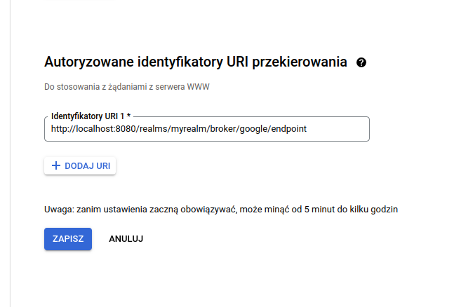

### Keycloak - dodawanie Identity Providera (Google)

Wchodzimy na `developers.google.com`, wybieramy `Google API Console`,  
następnie `Dane logowania` i `Utwórz dane logowania -> Identyfikator klienta OAuth`.

Po utworzeniu identyfikatora przechodzimy do jego szczegółów i kopiujemy
`Identyfikator klienta`, oraz `Tajny klucz klienta`

Logujemy się do konsoli administratora w naszej instancji keycloaka, a następnie wybieramy  
`Configure -> Identity providers -> Add provider -> Google`

Kopiujemy `Redirect URI`, wracamy do googla i wstawiamy go tam.

Zapisujemy - zarówno providera w keycloaku, jak i identyfikator w google.

### Sprawdzenie konfiguracji

Przechodzimy na `https://keycloak.org/app/`

Klikamy `Save`, następnie `Sign in`. Naszym oczom powinien ukazać się standardowy ekran logowania keycloaka rozszerzony o możliwość zalogowania przez Google.

Wybieramy `Google`, uzupełniamy dane i... jesteśmy zalogowani.

### Zadanie dodatkowe - Github Identity Provider

Przechodzimy do konsoli administratora naszej instancji keycloaka, a następnie wybieramy  
`Configure -> Identity providers -> Add provider -> Github`

Kopiujemy `Redirect URI`.

Przechodzimy na `https://github.com/settings/developers`

Wybieramy `OAuth Apps` -> `New OAuth App`, uzupełniamy jak na screenie poniżej.

Rejestrujemy aplikację, przechodzimy w szczegóły i kopiujemy `Client ID` i `Client secret`.

Wracamy do keycloaka, uzupełniamy brakujące pola i dodajemy providera.
 
Przy ponownej próbie zalogowania dochodzi nam możliwość zalogowania się przez Githuba.

### Porównanie uwierzytelnienia opartego na haśle, oraz uwierzytelnienia wieloskładnikowego

**Uwierzytelnienie** jest to proces polegający na potwierdzeniu, że dany podmiot jest w rzeczywistości tym,
za kogo się podaje.  
Tym samym im więcej składników składa się na sukces takiego procesu tym mamy większe prawdopodobieństwo,
że faktycznie nie doszło do żadnych naruszeń.  

**Uwierzytelnienie oparte na haśle** polega na uwierzytelnieniu na podstawie ustalonego wcześniej ciągu znaków.  
Metoda o tyle niebezpieczna, że znajomość pary login/hasło pozwala na uzyskanie dostępu do naszych danych dowolnej jednostce. Powinniśmy stosować ją tylko wtedy, gdy nie mamy innej możliwości (wiele serwisów nie udostępnia logowania dwu/wieloskładnikowego).

**Uwierzytelnienie wieloskładnikowe** polega zazwyczaj na uwierzytelnieniu na podstawie hasła, oraz dodatkowego składnika.  
Dodatkowym składnikiem może być:
* coś co wiesz - informacja będąca w Twoim posiadaniu, np. kod pin,
* coś co masz - na przykład smartfon (authenticator), lub bezpieczny klucz USB,
* coś czym jesteś - metody biometryczne.

Uwierzytelnienie wieloskładnikowe sugerowane jest wszędzie tam gdzie to możliwe. W szczególności powinniśmy włączyć je w newralgicznych miejscach jak dostęp do banku, czy dostęp do naszej poczty.

